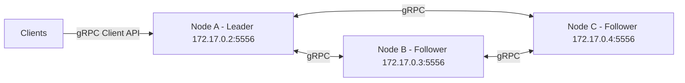

<a name="readme-top"></a>


<!-- [![Contributors][contributors-shield]][contributors-url] -->
<!-- [![Forks][forks-shield]][forks-url] -->
<!-- [![Stargazers][stars-shield]][stars-url] -->
<!-- [![Issues][issues-shield]][issues-url] -->

<!-- PROJECT LOGO -->
<br />
<div align="center">


<h1 align="center">Distributed Key Value Store</h1>
<h2 align="center">An attempt to create a highly available distributed key-value store</h2>
  <p align="center">
  </p>
</div>


<!-- ABOUT THE PROJECT -->
## About The Project


A fault-tolerant, replicated key-value store implemented in C++ using a Raft-inspired consensus algorithm and gRPC for inter-node communication. The system is designed to prioritize correctness, debuggability, and clarity of ownership over premature optimization.

<p align="right">(<a href="#readme-top">back to top</a>)</p>


## 🧠 High-Level Architecture

#### Each node in the cluster runs:

- a consensus module (leader election, log replication)
- an in-memory key-value store
- a persistent log
- a gRPC server for RPCs (AppendEntries and user requests  etc.)
  


##### Note: Clients can only send requests to leader
<p align="right">(<a href="#readme-top">back to top</a>)</p>

## Core Design Decisions

This section highlights the key architectural choices made in the system and the trade-offs involved.

### 1. Raft-Inspired Consensus (Not Strict Raft)
The system follows Raft’s core ideas (leader election, replicated log, majority-based decisions) but is **not a strict implementation of the Raft paper**.  
In particular, leader liveness is detected via **follower-initiated checks** rather than leader-pushed heartbeats. This simplifies leader logic and still allows correct failure detection, at the cost of deviating from textbook Raft.

### 2. Persistent Log with Replay-Based Recovery
Log entries are persisted to disk and, on restart, the node rebuilds its state by **replaying the entire log**.
Snapshotting and log compaction are intentionally deferred to:
- reduce correctness complexity early
- make recovery behavior explicit and debuggable  
This results in slower startup for large logs but simpler and more reliable recovery semantics.

### 3. Serialized Log Mutation
All Raft log mutations are **explicitly serialized** using clear synchronization boundaries.
Rather than attempting fine-grained or lock-free log updates, the design prioritizes:
- correctness
- predictable behavior under failure
- ease of reasoning and debugging

### 4. Explicit Ownership and Lifetime Management
The code avoids implicit sharing and hidden lifetimes:
- gRPC channels are long-lived
- stubs are lightweight
- `grpc::ClientContext` objects are created per RPC and never reused  
This strictly follows gRPC threading and lifetime guarantees and prevents subtle concurrency bugs.

### 5. Simplicity Over Premature Optimization
The system intentionally favors simple, readable implementations over aggressive optimizations.
The goal is to build a system that:
- fails predictably
- is easy to reason about
- can be extended incrementally (e.g., snapshotting, membership changes)

Performance optimizations are considered secondary to correctness at the current stage.
<p align="right">(<a href="#readme-top">back to top</a>)</p>


## 🚀 Features

### Core Raft inspired Functionality
- [x] **Leader Election**
- [x] **Heartbeat Mechanism (AppendEntries with empty logs)**
- [x] **Custom Raft inspired Consensus Implementation**
- [x] **Failure Detection & Handling**
- [x] **Log Replication**

### Storage & Recovery
- [x] **Persistent Log Storage**
- [x] **Crash Recovery via Log Replay**
- [ ] **Snapshotting / Log Compaction**
- [ ] **Fast Startup (Snapshot-based Recovery)**

### System Properties
- [x] **Replicated In-Memory Key-Value Store**
- [x] **gRPC-based RPC Layer**
- [x] **Thread-safe Log Management**
<p align="right">(<a href="#readme-top">back to top</a>)</p>


## Built With
* [![gRPC-shield][gRPC-shield]][gRPC-link]
* [![C++-shield][C++-shield]][C++-link]
* [![GTest-shield][GTest-shield]][GTest-link]
* [![Docker][Docker]][Docker-url]
* [![Hugging-face.com][Hugging-face.com]][Hugging-face-url]


<p align="right">(<a href="#readme-top">back to top</a>)</p>

<!-- GETTING STARTED -->
## Getting Started

Follow the below installations to setup.

### Installation

#### 1. Build the docker file 
   ```sh
   cd Distributed_Key_Value_Store
   docker image build -t distributed_key_value_store .
   ```
#### 2. Start the docker container
  ```sh
  docker container run -it distributed_key_value_store bash 
  ```
#### 3. start the application
   ```sh
   # distributed_kv_store <election low> <election high> <heartbeat_timeout> <max retries> <num_nodes> <member_ip_port> <db path>
   distributed_kv_store 300 600 50 3 3 172.17.0.2:5556 /tmp
   ```
   If inputs are incorrect it will prompt you with how to start and run the application . 
   This step shows starting of one node you will have to start num_nodes(the parameter you passed while starting) and give it ip address of one of the other nodes which is already in the cluster.
   A simple way to do this is to just start the first node with it's own ip and use the same command on every other node.
   ##### If a node fails and you want to start it make sure to give it a ip address of one of the other active nodes in the cluster

<p align="right">(<a href="#readme-top">back to top</a>)</p>

## Limitations & Future Work

This project prioritizes correctness, clarity, and debuggability over full protocol completeness. The following limitations and future improvements are acknowledged.

### Current Limitations
- **No Snapshotting / Log Compaction**  
  Nodes recover by replaying the full persistent log, which causes startup time to grow with log size.

- **Dynamic Membership via Bootstrap (Not Joint Consensus)**  
  New nodes can dynamically join the cluster by bootstrapping from the IP address of an existing node.  
  Membership changes are supported in practice but are **not implemented using Raft’s formal joint-consensus mechanism**, which limits theoretical guarantees during concurrent reconfiguration.

- **Follower-Initiated Leader Liveness Checks**  
  Leader availability is detected via follower-initiated checks rather than leader-pushed heartbeats, deviating from canonical Raft.

- **In-Memory State Machine**  
  The key-value store is kept in memory and rebuilt from the replicated log on restart.

- **Limited Network Fault Coverage**  
  The system has been tested primarily under node crashes and restarts; extended testing under network partitions and delays is limited.

### Future Work
- **Snapshotting and Log Compaction**  
  Introduce snapshots to bound log growth and improve recovery time.

- **Formal Membership Changes (Joint Consensus)**  
  Extend dynamic membership support to follow Raft’s joint-consensus approach for safer reconfiguration.

- **InstallSnapshot RPC**  
  Enable efficient state transfer for lagging or newly joined nodes.

- **Stronger Client Semantics**  
  Improve client-facing guarantees and commit acknowledgment behavior.

- **Fault Injection and Stress Testing**  
  Validate correctness under partitions, message delays, and concurrent failures.

- **Performance Benchmarking**  
  Measure throughput, latency, and recovery time under varying workloads and cluster sizes.
<p align="right">(<a href="#readme-top">back to top</a>)</p>

## Acknowledgement 
### Notes

AI-assisted tools (including GPT-based models) were used during development
to help reason about design decisions, debug complex issues, and validate
understanding of distributed systems concepts. All core logic, architecture,
and implementation decisions were written and owned by the author.
## Contact

Mahesh Ghumare [LinkedIn](https://www.linkedin.com/in/mahesh-ghumare-37894a200/)

<p align="right">(<a href="#readme-top">back to top</a>)</p>


[contributors-shield]: https://img.shields.io/github/contributors/MaheshG11/E-commerce-Chat-agent.svg?style=for-the-badge
[contributors-url]: https://github.com/MaheshG11/E-commerce-Chat-agent/graphs/contributors
[forks-shield]: https://img.shields.io/github/forks/MaheshG11/E-commerce-Chat-agent.svg?style=for-the-badge
[forks-url]: https://github.com/MaheshG11/E-commerce-Chat-agent/network/members
[stars-shield]: https://img.shields.io/github/stars/MaheshG11/E-commerce-Chat-agent.svg?style=for-the-badge
[stars-url]: https://github.com/MaheshG11/E-commerce-Chat-agent/stargazers
[issues-shield]: https://img.shields.io/github/issues/MaheshG11/E-commerce-Chat-agent.svg?style=for-the-badge
[issues-url]: https://github.com/MaheshG11/E-commerce-Chat-agent/issues
[linkedin-shield]: https://img.shields.io/badge/-LinkedIn-black.svg?style=for-the-badge&logo=linkedin&colorB=555
[linkedin-url]: https://linkedin.com/in/mahesh-ghumare-37894a200
[product-screenshot]: images/screenshot.png


[Docker]:https://img.shields.io/badge/docker-%230db7ed.svg?style=for-the-badge&logo=docker&logoColor=white
[Docker-url]:https://www.docker.com/


[Hugging-face.com]:https://img.shields.io/badge/-RocksDB-FDEE21?style=for-the-badge&logo=RocksDB&logoColor=black
[Hugging-face-url]:https://rocksdb.org/
[C++-shield]:https://img.shields.io/badge/C++-00599C?style=flat-square&logo=C%2B%2B&logoColor=white
[C++-link]:https://isocpp.org/
[gRPC-shield]:https://img.shields.io/badge/gRPC-blue?logo=grpc
[gRPC-link]:https://grpc.io/
[GTest-shield]:https://img.shields.io/badge/GoogleTest-blue
[GTest-link]:https://google.github.io/googletest/
